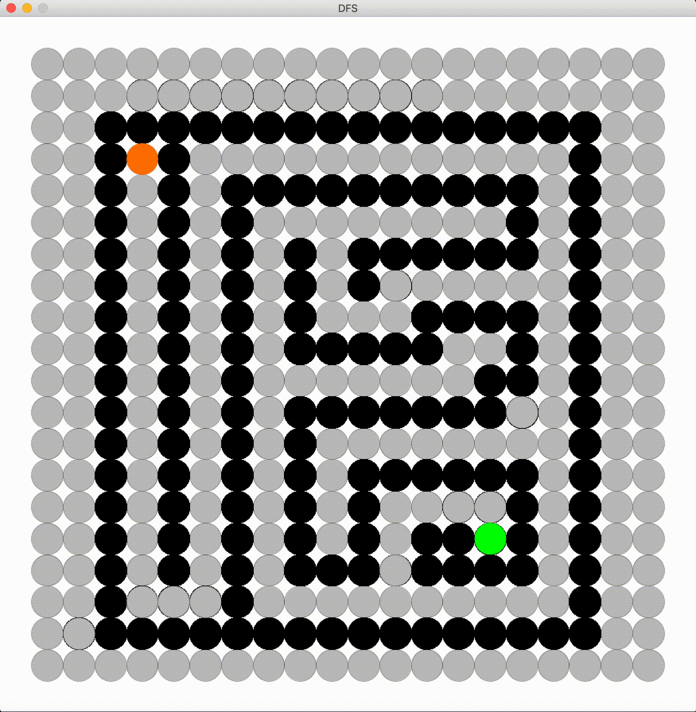
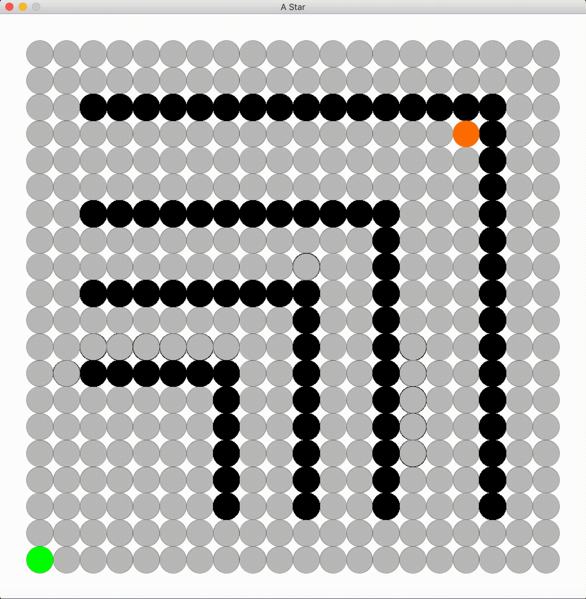

# Graph_Traversal_Visualisation
Simulating generally known _graph algorithms_ for solving user defined puzzles.

### Running the simulation  
Use `make run` to run the simulation and try various algorithms. There are various steps, taking inputs form keyboard, to design the puzzle.zxc

#### Commands for simulation  
  - *Run*   : R (ADDMODE Decrease/Unblock)
  - *Set*   : A (ADDMODE Increase/Block) 

  - *Terminal*  : S (Set Start) or E (Set End) 

  - *Start*  : Enter (Change to PLANEMODE) 
  - *Exit*   : X (Exit a Simulation)

#### Preview

- BFS

</img>

- DFS

</img>

- Greedy BFS

</img>

- A*

</img>

